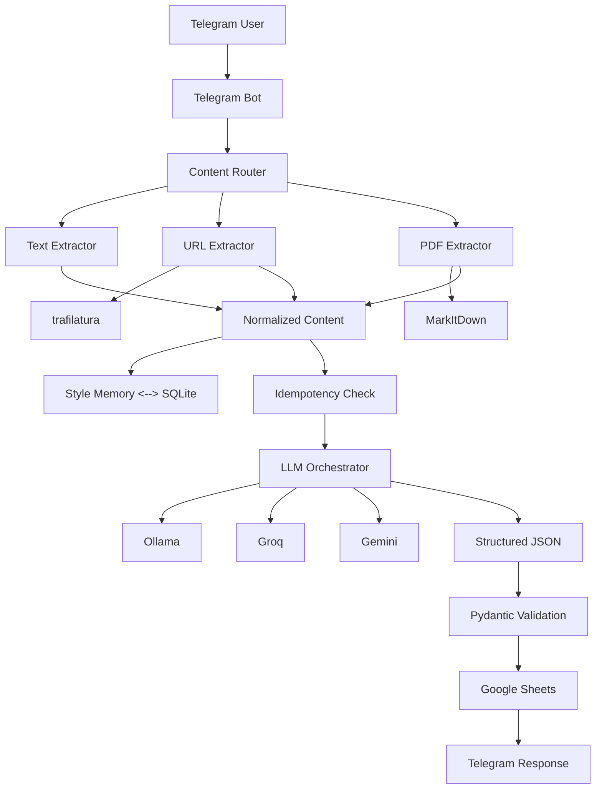

# Telegram Content Agent

[](https://render.com/deploy?repo=https://github.com/Manirider/Telegram-Content-Agent)

A production-grade Telegram bot that ingests text, URLs, and PDFs, applies persistent user-specific style memory, generates structured content via LLM orchestration (Ollama with Groq/Gemini fallback), and writes results idempotently to Google Sheets.

## Architecture

```
┌─────────────┐     ┌──────────────┐     ┌──────────────────┐
│  Telegram   │────▶│  Content     │────▶│  Normalized      │
│  User       │     │  Router      │     │  Content         │
└─────────────┘     └──────────────┘     └────────┬─────────┘
                                                   │
                    ┌──────────────┐     ┌────────▼─────────┐
                    │   Style      │◀───▶│   LLM            │
                    │   Memory     │     │   Orchestrator   │
                    │   (SQLite)   │     │                  │
                    └──────────────┘     └────────┬─────────┘
                                                   │
                    ┌──────────────┐     ┌────────▼─────────┐
                    │  Idempotency │────▶│  Google Sheets   │
                    │  (SQLite)    │     │                  │
                    └──────────────┘     └──────────────────┘
```

### Mermaid Diagram



## Technology Stack

| Component | Technology |
|-----------|------------|
| Language | Python 3.12 |
| Telegram | python-telegram-bot 21.4 |
| Local LLM | Ollama |
| Cloud LLMs | Groq, Google Gemini |
| Sheets | gspread, Google Sheets API |
| Database | SQLite (aiosqlite) |
| Web Extraction | trafilatura |
| PDF Extraction | microsoft/markitdown |
| Validation | Pydantic 2 |
| Config | pydantic-settings |
| Logging | structlog |
| Retry | tenacity |
| Container | Docker, docker-compose |
| Testing | pytest, pytest-asyncio |

## Repository Structure

```
telegram-content-agent/
├── app/
│   ├── main.py                 # Application entry point
│   ├── config/
│   │   └── settings.py         # Configuration management
│   ├── bot/
│   │   ├── handlers.py         # Telegram command/message handlers
│   │   └── telegram_service.py # Telegram API wrapper
│   ├── ingestion/
│   │   ├── router.py           # Content type routing
│   │   ├── text_extractor.py   # Plain text processing
│   │   ├── url_extractor.py    # URL extraction (trafilatura)
│   │   ├── pdf_extractor.py    # PDF extraction (MarkItDown)
│   │   └── models.py           # Content data models
│   ├── llm/
│   │   ├── base.py             # LLM provider interface
│   │   ├── ollama_client.py    # Ollama provider
│   │   ├── groq_client.py      # Groq provider
│   │   ├── gemini_client.py    # Gemini provider
│   │   ├── orchestrator.py     # Provider fallback orchestration
│   │   ├── prompts.py          # Prompt engineering
│   │   ├── schemas.py          # Pydantic output schemas
│   │   └── parser.py           # JSON parsing & recovery
│   ├── memory/
│   │   ├── sqlite_repository.py # SQLite persistence
│   │   ├── service.py          # Style memory service
│   │   └── models.py           # Memory data models
│   ├── sheets/
│   │   ├── client.py           # Google Sheets API client
│   │   ├── repository.py       # Sheets operations with idempotency
│   │   └── schemas.py          # Sheets data models
│   ├── services/
│   │   ├── content_service.py  # Main processing pipeline
│   │   └── idempotency.py      # Idempotency service
│   ├── utils/
│   │   ├── logging.py          # Structured logging
│   │   ├── exceptions.py       # Custom exceptions
│   │   ├── hashing.py          # Content fingerprinting
│   │   ├── text.py             # Text utilities
│   │   ├── urls.py             # URL validation
│   │   └── retry.py            # Retry utilities
│   └── health/
│       └── service.py          # HTTP health endpoints
├── tests/
│   ├── unit/                   # Unit tests
│   ├── integration/            # Integration tests
│   ├── contract/               # Contract tests
│   └── fixtures/               # Test fixtures
├── scripts/
│   └── healthcheck.py          # Container health check script
├── docs/
│   ├── REQUIREMENTS_TRACEABILITY.md
│   └── FINAL_AUDIT.md
├── Dockerfile
├── docker-compose.yml
├── .env.example
├── .gitignore
├── requirements.txt
├── pytest.ini
└── README.md
```

## Setup

### Prerequisites

- Docker and docker-compose
- Telegram Bot Token (from [@BotFather](https://t.me/BotFather))
- Google Cloud Project with Sheets API enabled
- Google Service Account with Sheets access
- (Optional) Groq API key from [console.groq.com](https://console.groq.com)
- (Optional) Gemini API key from [aistudio.google.com](https://aistudio.google.com)

### Google Cloud Setup

1. Create a Google Cloud Project
2. Enable Google Sheets API and Google Drive API
3. Create a Service Account
4. Grant Editor role on the project (or minimal Sheets/Drive permissions)
5. Create and download JSON key
6. Share your Google Spreadsheet with the service account email
7. Encode credentials: `cat credentials.json | base64 -w 0`

### Environment Variables

Copy `.env.example` to `.env` and fill in:

```bash
cp .env.example .env
# Edit .env with your values
```

Required variables:
- `TELEGRAM_BOT_TOKEN` - From BotFather
- `GOOGLE_SHEETS_CREDENTIALS_B64` - Base64 encoded service account JSON
- `GOOGLE_SHEETS_SPREADSHEET_ID` - From spreadsheet URL

Optional variables:
- `OLLAMA_BASE_URL` - Default: http://ollama:11434
- `OLLAMA_MODEL` - Default: llama3.1
- `GROQ_API_KEY` - For cloud fallback
- `GROQ_MODEL` - Default: llama-3.1-70b-versatile
- `GEMINI_API_KEY` - For cloud fallback
- `GEMINI_MODEL` - Default: gemini-1.5-flash
- `LLM_PRIMARY_PROVIDER` - Default: ollama
- `LLM_FALLBACK_PROVIDERS` - Default: groq,gemini

### Running with Docker

```bash
# Build and start
docker-compose up --build -d

# View logs
docker-compose logs -f app

# Stop
docker-compose down

# Stop and remove volumes
docker-compose down -v
```

### Local Development

```bash
# Create virtual environment
python -m venv venv
source venv/bin/activate  # Windows: venv\Scripts\activate

# Install dependencies
pip install -r requirements.txt

# Run with local .env
cp .env.example .env
# Edit .env
python -m app.main
```

## Bot Commands

| Command | Description |
|---------|-------------|
| `/start` | Show welcome message and capabilities |
| `/setstyle <description>` | Set your writing style preference |
| `/getstyle` | View current style |
| `/clearstyle` | Clear style preference |

### Style Examples

```
/setstyle Write in a witty, informal tone with emojis.
/setstyle Always include a specific data point or statistic.
/setstyle All output must be in the form of a haiku.
/setstyle Professional but accessible, like a senior engineer explaining to a junior.
```

## Content Ingestion

### Text
Send any plain text message. The bot will process it directly.

### URLs
Send a single URL (http/https). The bot will:
1. Validate the URL
2. Fetch with realistic User-Agent
3. Extract article content via trafilatura
4. Process the extracted text

### PDFs
Upload a PDF file (≤50MB by default). The bot will:
1. Download the file
2. Convert to Markdown via MarkItDown
3. Process the extracted text

## Style Memory

- Per-user persistent style preferences stored in SQLite
- Survives container restarts via Docker volume
- Applied as stylistic layer on top of system constraints
- System constraints (JSON format, 280 char limit, distinct variants) always win

## Idempotency Design

### The Challenge
Same URL + different style = different output. Naive URL-only deduplication breaks this.

### Solution
Fingerprint = SHA256(source_identifier + content_hash + style_hash)

- **Text/PDF**: Content hash = SHA256(normalized content)
- **URL**: Source identifier = original URL (as required)
- **Style hash**: SHA256(style_prompt) or "no-style"

### Behavior
| Scenario | Result |
|----------|--------|
| Same content, same style | Duplicate → Rejected |
| Same content, different style | New row → Generated |
| Same URL, content changed | New row → Generated |
| Concurrent identical requests | First wins, second rejected |

## LLM Fallback Strategy

```
Primary (Ollama) → Transient failure → Retry (3x with backoff)
                                    ↓
                            All retries failed
                                    ↓
                            Fallback 1 (Groq) → Retry → Fallback 2 (Gemini)
                                    ↓
                            All providers failed → User error
```

### Error Classification
- **Transient** (retry): Timeout, connection error, 5xx, rate limit
- **Permanent** (no retry): 401, 403, invalid model, validation error
- **Rate limit**: Special handling with longer backoff

### Configuration
```env
LLM_PRIMARY_PROVIDER=ollama
LLM_FALLBACK_PROVIDERS=groq,gemini
MAX_RETRIES=3
RETRY_BASE_DELAY=1.0
RETRY_MAX_DELAY=60.0
RETRY_JITTER=0.1
```

## Google Sheets Schema

Exact columns (required):

| Column | Description |
|--------|-------------|
| SourceIdentifier | Original URL, "text:{msg_id}", or "pdf:{filename}" |
| SubmissionTimestamp | ISO 8601 UTC timestamp |
| ContentType | text \| url \| pdf |
| LLMTitle | Generated title |
| Rationale | Editorial rationale |
| Category | Single category |
| X_Variant | X post (≤280 chars) |
| LinkedIn_Variant | LinkedIn post |

Headers are initialized automatically if missing.

## X Post Validation

- Hard limit: 280 characters
- If LLM exceeds: Automatic repair attempt (truncate at word boundary)
- If repair fails: Regeneration with corrective prompt
- Final safeguard: Hard truncation with ellipsis

## Health Checks

Two endpoints on port 8080:

| Endpoint | Purpose |
|----------|---------|
| `GET /health` | Liveness - process is alive |
| `GET /ready` | Readiness - critical deps initialized |
| `GET /live` | Kubernetes liveness probe alias |

Docker healthcheck uses `/health`.

## Webhook vs Long Polling

### Decision: Long Polling

**Reasoning:**
1. **Free-tier friendly**: No public HTTPS endpoint needed. Works on free hosting (Fly.io, Railway, Render free tiers) that sleep on inactivity.
2. **Cold start resilience**: Webhooks fail when container wakes from sleep. Long polling initiates connection from inside.
3. **Simpler deployment**: No reverse proxy, SSL certs, or public IP management.
4. **Reliability**: Bot controls connection; automatic reconnection on network issues.

**Trade-offs:**
- Slightly higher latency (negligible for this use case)
- Constant connection (minimal resource usage)

**Not implemented**: Webhook support. If needed, would require:
- Public HTTPS endpoint
- Reverse proxy (nginx/Traefik)
- SSL termination
- Wake-up handling for sleeping containers

## Security Considerations

- **No secrets in code**: All via environment variables
- **Base64 credentials**: Service account JSON never written to disk
- **SSRF protection**: Blocks localhost, private IPs, .local domains
- **File size limits**: Configurable max PDF size
- **Input validation**: Pydantic validation at every boundary
- **SQL injection prevention**: Parameterized queries only
- **Prompt injection defense**: System prompt isolates user content
- **Non-root container**: Runs as appuser (UID 1000)
- **Minimal attack surface**: Only health port exposed

## Testing

```bash
# Run all tests
pytest

# Run with coverage
pytest --cov=app --cov-report=html

# Run specific test types
pytest -m unit
pytest -m integration
pytest -m contract

# Run in Docker
docker-compose run --rm app pytest
```

### Test Categories

| Category | Coverage |
|----------|----------|
| Unit | Hashing, routing, validation, parsing, retry logic |
| Integration | SQLite, fake LLM, fake Sheets, full pipelines |
| Contract | Sheets headers, content types, X length, variants distinct |

### Mandatory Acceptance Tests

1. `/start` → Welcome response
2. Plain text → Sheets row, ContentType=text, all fields populated
3. URL → Extracted, ContentType=url, SourceIdentifier=original URL
4. PDF → MarkItDown conversion, ContentType=pdf, fields populated
5. Duplicate URL → Second submission rejected
6. `/setstyle` + content → Style reflected in output
7. Style change + same URL → New row with new style
8. X post ≤ 280 chars
9. X post ≠ LinkedIn post
10. All fields non-empty

## Deployment

### Production Checklist

- [ ] Set strong `TELEGRAM_BOT_TOKEN`
- [ ] Configure Google Service Account with minimal permissions
- [ ] Share spreadsheet with service account email only
- [ ] Set `GROQ_API_KEY` and/or `GEMINI_API_KEY` for fallback
- [ ] Pull Ollama model: `docker exec -it telegram-content-agent-ollama ollama pull llama3.1`
- [ ] Configure log aggregation (CloudWatch, Datadog, etc.)
- [ ] Set up monitoring on `/health` and `/ready`
- [ ] Configure alerts on error rates
- [ ] Test disaster recovery (volume backup/restore)

### Resource Requirements

| Component | CPU | Memory | Disk |
|-----------|-----|--------|------|
| App | 0.5-1 core | 512MB-1GB | 100MB |
| Ollama (llama3.1) | 2-4 cores | 8-16GB | 5-10GB |
| SQLite | Minimal | Minimal | <100MB |

**Note**: Ollama requires significant resources. For free-tier deployment, rely on cloud fallbacks (Groq/Gemini) and omit Ollama service.

### Fly.io Deployment

```bash
fly launch --no-deploy
# Edit fly.toml
fly secrets set TELEGRAM_BOT_TOKEN=... GOOGLE_SHEETS_CREDENTIALS_B64=... GOOGLE_SHEETS_SPREADSHEET_ID=...
fly deploy
```

### Railway/Render

1. Connect GitHub repo
2. Add environment variables
3. Deploy (uses Dockerfile automatically)

## Troubleshooting

| Issue | Solution |
|-------|----------|
| Bot not responding | Check `docker-compose logs app` for token errors |
| Sheets "Permission denied" | Verify service account has Editor access to spreadsheet |
| Ollama "model not found" | Pull model: `docker exec ollama ollama pull llama3.1` |
| PDF extraction fails | Check file size limit, try smaller PDF |
| URL extraction empty | Site may block bots; trafilatura can't extract all sites |
| X post > 280 chars | Check logs for validation errors; LLM may need correction |
| Duplicate not detected | Verify style hasn't changed; check fingerprint calculation |

## Example Google Sheets Output

| SourceIdentifier | SubmissionTimestamp | ContentType | LLMTitle | Rationale | Category | X_Variant | LinkedIn_Variant |
|-----------------|---------------------|-------------|----------|-----------|----------|-----------|------------------|
| https://example.com/article | 2024-01-15T10:30:00Z | url | "AI Transforms Healthcare" | "Key insight: diagnostic accuracy..." | Technology | "🏥 AI now detects cancer 95% accurately. Early diagnosis saves lives. #AI #Healthcare" | "The latest research shows AI achieving 95% diagnostic accuracy in cancer detection. This represents a significant leap forward..." |

## Known Limitations

1. **Ollama resource intensive**: May not run on free tiers. Cloud fallbacks recommended.
2. **URL extraction**: Some sites block automated access (paywalls, bot detection).
3. **PDF extraction**: Complex layouts, scanned PDFs, or encrypted files may not extract well.
4. **Single worksheet**: All users write to same "Content" sheet.
5. **No user management**: Anyone with bot access can use it.
6. **Long polling only**: Not suitable for high-throughput scenarios (>30 msg/sec).

## License

MIT License - See LICENSE file for details.

## Author

MANIKANTA SURYASAI 
AIML DEVELOPER | ENGINEER